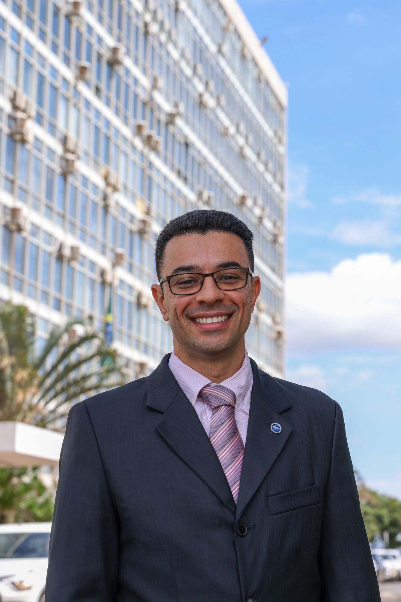

{.bio-photo}

I am an applied economist driven by a strong interest in understanding how rigorous empirical analysis can inform and improve public policy. My career has moved across academia, legislative advising, and executive roles in the Brazilian federal government, always with the goal of turning evidence into decisions that have real impact on institutions and people's lives.

I currently serve as [Director of the Department of Bioindustry](https://www.gov.br/mdic/pt-br/composicao/secretaria-de-economia-verde-descarbonizacao-e-bioondustria-sev/departamento-de-bioindustria-e-insumos-estrategicos-da-saude/raphael-rocha-gouvea) within Brazil's Secretariat for Green Economy, Decarbonization and Bioindustry, where I help shape Brazil's strategy for industrial development of the green and bio-based economy. I am also a researcher at [IPEA](https://www.ipea.gov.br) (currently on leave) and a professor at [IBMEC-Brasília](https://www.ibmec.br/o-ibmec/unidades/brasilia) where I teach applied econometrics.

Before taking on this role, I worked as Senior Economic Advisor to Congresswoman Tabata Amaral. In Congress, I helped design and defend major reforms, including the New Legal Framework for Technical and Vocational Education, the Pé-de-Meia program to increase high-school student retention, and various topics on macroeconomics, tax reforms, and fiscal regimes.

I hold a Ph.D. and M.A. from the University of Massachusetts Amherst, an M.A. from the University of São Paulo, and a B.A. from the Federal University of Minas Gerais.
